<p align="center">
   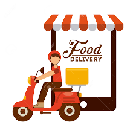
 </p>

<h2 align="center">Fast delivery</h2>

## 📝 Table of Contents

- [About](#about)
- [Getting Started](#getting_started)
- [Usage](#usage)
- [Built Using](#built_using)
- [Contributing](../CONTRIBUTING.md)
- [Authors](#authors)

## 🧐 About <a name = "about"></a>

Our project focuses on a food delivery app that allows a user to enter his location for food options local to his destination. It provides these options along with their respective prices from available prices from available restaurants and also performs all calculations involving the purcharse.
The user is also allowed to choose between pickup and delivery, which ever is convenient

## 🏁 Getting Started <a name = "getting_started"></a>

### Prerequisites

- nodejs

- android studio

- vscode

- react-native 

### Installing

Clone the repository

```
git clone <repo name>
```
Run npm install to install all the dependencies within the project 

```
npm install
```

Run npm start to start up the app

```
npm start
```
<p align="center">
 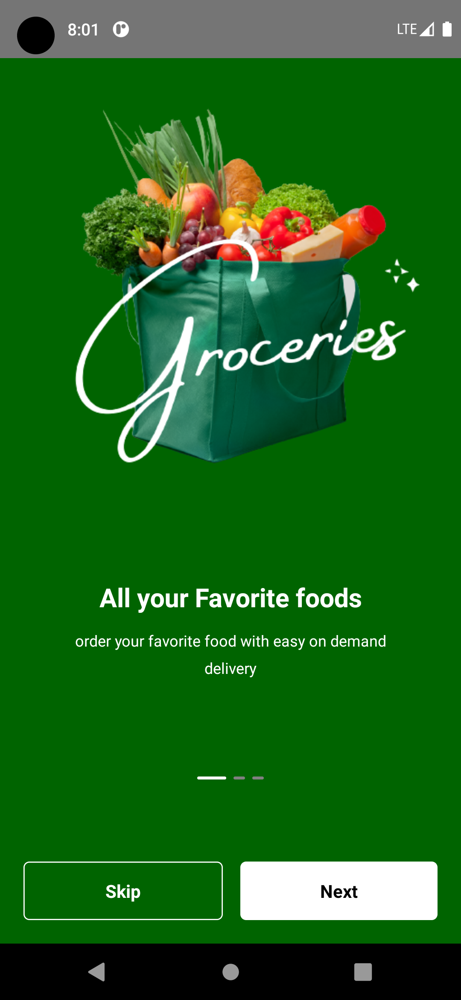
  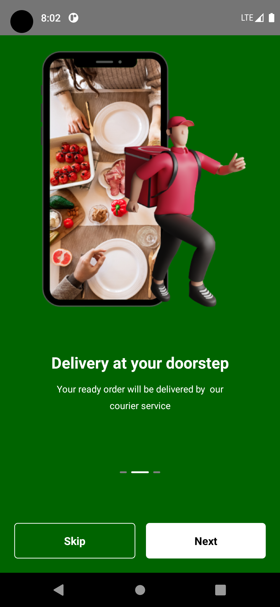
  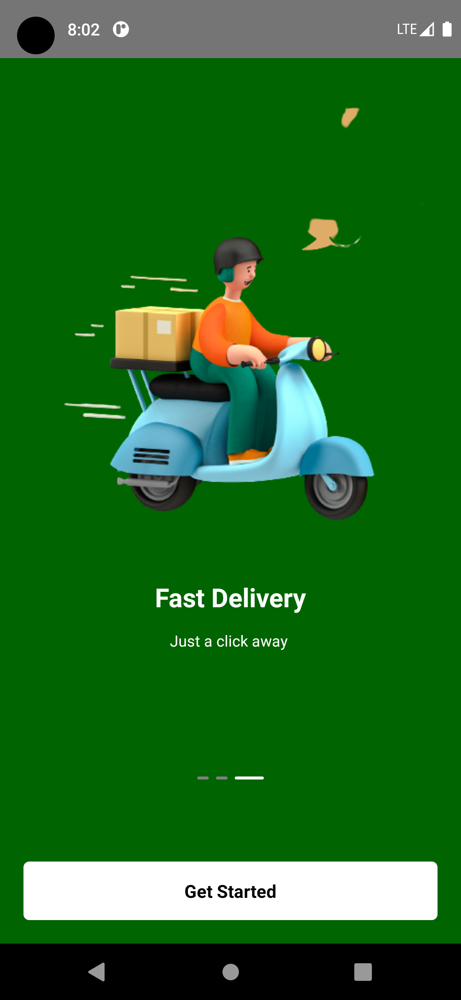
  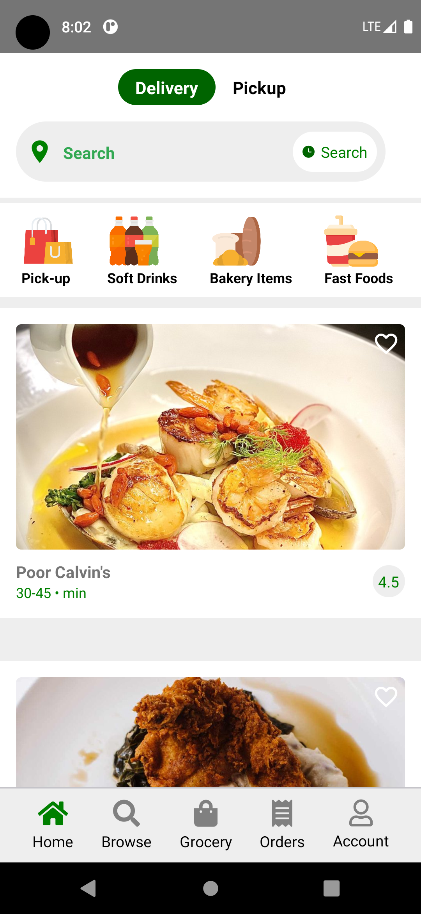
  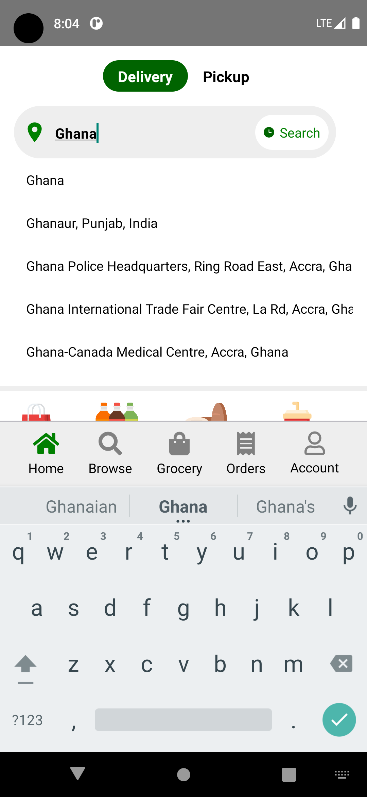
  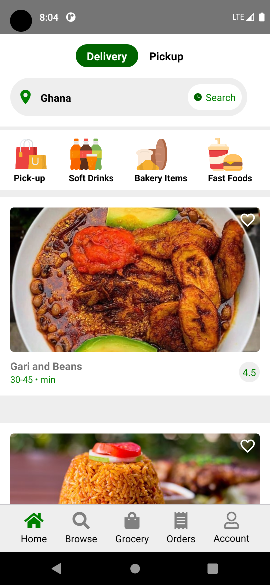
  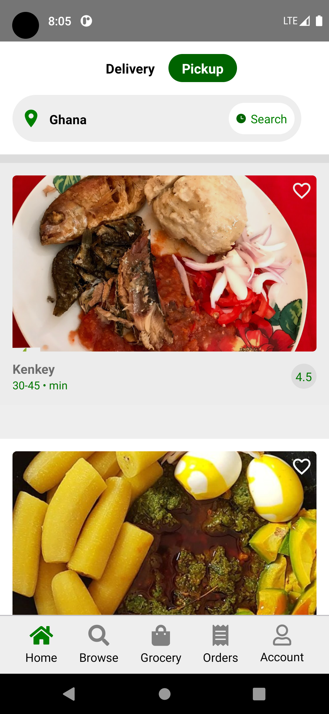
  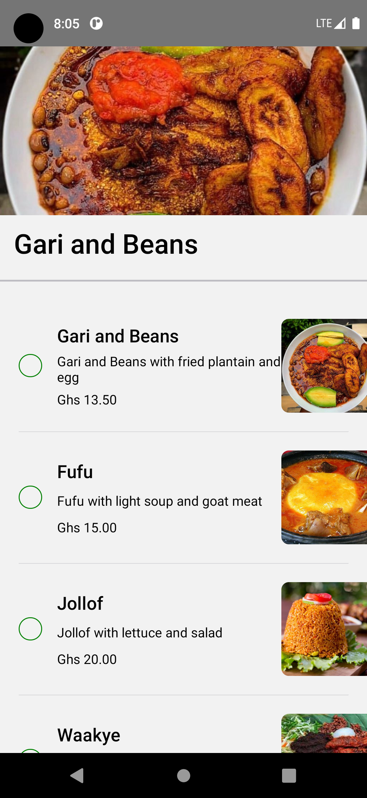
  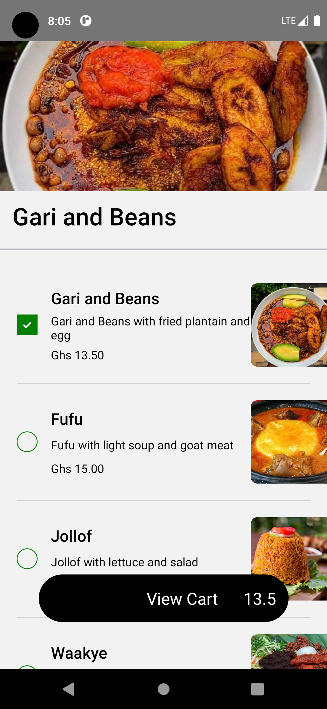
  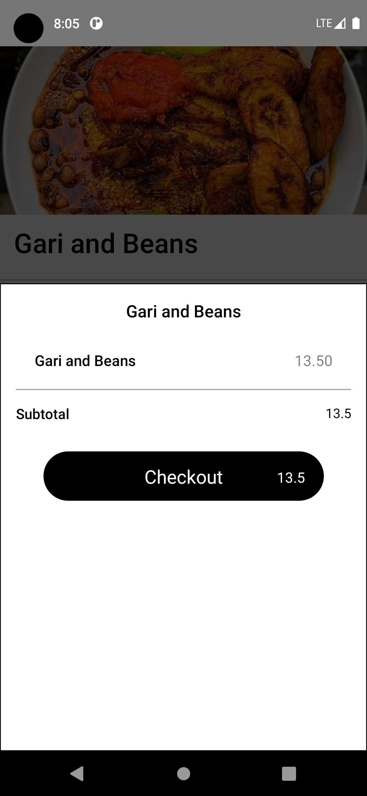
  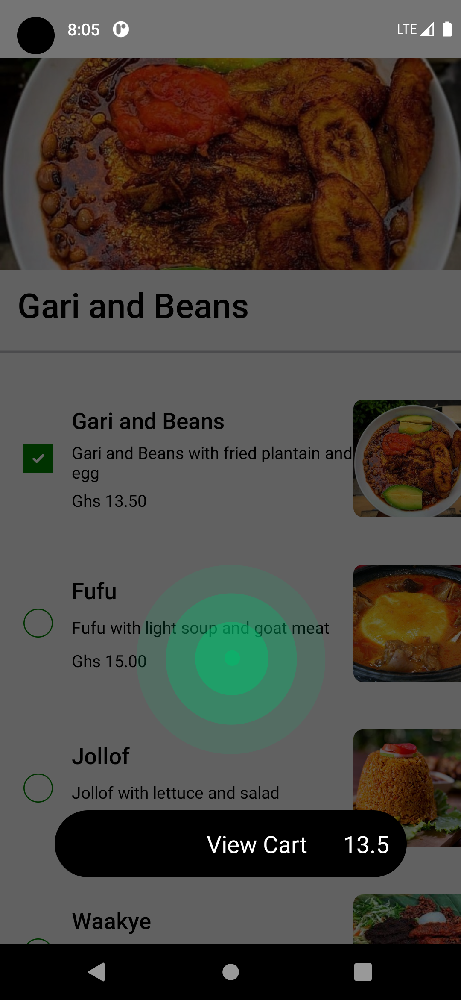
   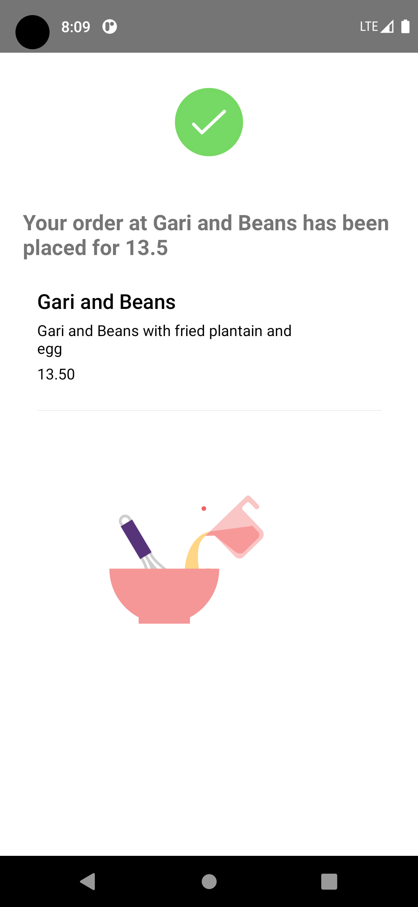
</p>

## 🎈 Usage <a name="usage"></a>
1. Install npm on your machine
2. Clone the repository using git clone [Fast-delivery](https://github.com/codewithdarkwa/fast-delivery.git)
3. Open it in vscode and run npm install to install all the dependencies
4. Run npm start 
5. Choose a to preview it on the android  emulator


## ⛏️ Built Using <a name = "built_using"></a>

- [Firebase](https://firebase.google.com/) - Database
- [React Native](https://reactnative.dev/) - Client Framework
- [Yelp Api](https://www.yelp.com/) - Food api
- [Google Places Api](https://developers.google.com/maps/documentation/places/web-service/overview) - Google places autocomplete api
- [Redux](https://redux.js.org/) - Redux
- [NodeJs](https://nodejs.org/en/) - Server Environment

## ✍️ Authors <a name = "authors"></a>

- [@codewithdarkwa](https://github.com/codewithdarkwa) - Idea & Initial work

See also the list of [contributors](https://github.com/codewithdarkwa/The-Documentation-Compendium/contributors) who participated in this project.


